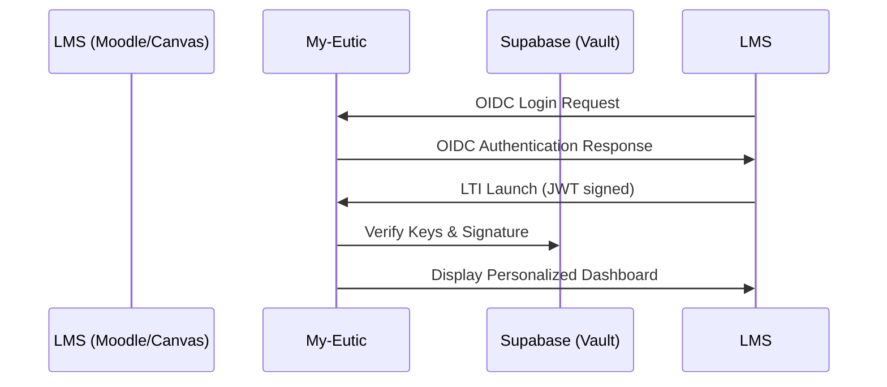

  
  
  # My-Eutic
  ### Transformando la educación mediante Inteligencia Artificial Socrática y Pensamiento Crítico
  
  
  
  
  [-brightgreen?style=for-the-badge)](#)

---

## 🚀 ¿Qué es My-Eutic?

**My-Eutic** no es un chatbot de respuestas rápidas. Es un **Tutor Socrático Digital** diseñado para integrarse nativamente en el ecosistema educativo (Moodle, Canvas, Blackboard) y fomentar el razonamiento autónomo. 

Nuestra misión es clara: **Adiós al copiar/pegar, Hola al pensamiento crítico.**

---

## 💎 Pilares Tecnológicos

### 🧠 IA Socrática Adaptativa
Utilizamos modelos de lenguaje avanzados (Google Gemini) optimizados con *prompts* pedagógicos que guían al alumno a través de la duda metódica. La IA detecta el nivel de comprensión y ajusta el "andamio" (scaffolding) en tiempo real.

### ♿ Inclusión por Diseño (NEE)
My-Eutic es la primera plataforma LTI que personaliza la conversación según las **Necesidades Educativas Especiales (NEE)** del perfil del alumno:
- **Dislexia / Disortografía**: Adaptación visual y textual.
- **TDAH**: Estímulos focales y sesiones fragmentadas.
- **TEA (Nivel 1)**: Comunicación estructurada y predictiva.
- **Altas Capacidades**: Retos de profundización lateral.

### 📄 Informes Pedagògicos de Alto Valor
Generamos informes automáticos para el docente que incluyen:
- **Métricas de Proceso**: No solo la respuesta, sino *cómo* ha llegado el alumno a ella.
- **Evidencias de Insight**: Citas literales de los momentos clave del razonamiento.
- **Redacción Académica**: Un resumen unificado de 700-850 palabras generado tras la aprobación del alumno.

---

## 🔌 Integración LTI 1.3 Advantage (Moodle-First)

My-Eutic es **"La integración perfecta para Moodle"**. Gracias al estándar de **Dynamic Registration**, puedes tener la herramienta operativa en menos de 30 segundos.

> [!IMPORTANT]
> **Dynamic Registration URL:**  
> `https://mvp.my-eutic.org/functions/v1/moodle-lti-connector/lti/config`

---

## 📂 Estructura de Documentación

| Sección | Descripción |
|---------|-------------|
| 📖 **[Guía del Profesor](docs/guia-profesor.md)** | Mejores prácticas pedagógicas y flujo de trabajo. |
| 🔌 **[Integración LTI](docs/lti-integration.md)** | Detalles técnicos para administradores de plataforma. |
| 🔒 **[Seguridad y Privacidad](docs/privacy-security.md)** | Cumplimiento RGPD, cifrado y gestión de datos. |
| 🛠️ **[Architecture Overview](docs/architecture.md)** | Visión de alto nivel del stack tecnológico. |

---

## 🛡️ Profesionalidad y Confianza

My-Eutic está construido bajo estándares **Enterprise-Level**:
- **Zero-Trust Architecture** en el manejo de datos.
- **Políticas RLS estrictas** (más de 125 políticas activas en Supabase).
- **GDPR Compliant**: Auditoría de IP, metadatos y firmas de NDA integradas en el proceso de registro.

---

  
Propiedad de <b>Bernat Sanroma</b> &bull; My-Eutic © 2026

  
<a href="https://my-eutic.org">Website Oficial</a> &bull; <a href="https://mvp.my-eutic.org">Plataforma MVP</a>

