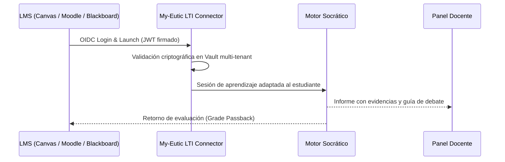

  
  
  # My-Eutic
  ### Infraestructura de IA Socrática para Entrenar, Observar y Evaluar el Pensamiento Crítico
  
  
  
  
  
  
  
  [-brightgreen?style=for-the-badge)](#)

---

## 🚀 ¿Qué es My-Eutic?

**My-Eutic** es la primera **infraestructura pedagógica socrática** diseñada para que la inteligencia artificial fomente el razonamiento propio en lugar de sustituirlo. Se integra nativamente en el entorno virtual de aprendizaje institucional (**Canvas LMS, Moodle, Blackboard Learn**) para devolver visibilidad docente sobre cómo piensan los estudiantes.

Frente a la ilusión de competencia que generan los modelos de lenguaje generalistas (donde el producto final se separa del proceso cognitivo), My-Eutic restaura el proceso:
> **No damos la respuesta. Provocamos pensamiento.**

---

## 📊 Escala Curricular y Métricas de Impacto

* 📚 **+9.500 tareas socráticas interactivas** (+5.800 retos conceptualmente únicos y probados).
* 🎓 **Educación Superior y Grados Universitarios**: Cobertura completa para grados y programas en *Digital Marketing, Digital Business, Administración y Dirección de Empresas (ADE), Economía, Habilidades Directivas y Toma de Decisiones*.
* 🏫 **Educación Secundaria y Bachillerato**: Cobertura integral de materias y situaciones de aprendizaje.
* 🌐 **Trilingüe Nativo**: Despliegue en **Castellano, Catalán e Inglés** en paralelo para programas internacionales y centros plurilingües.
* ⚙️ **Universal Curriculum Engine**: Capacidad para ingerir cualquier guía docente universitaria o currículo formativo y transformarlo en sesiones socráticas guiadas.
* 📈 **Evidencia Empírica de Pilotos**:
  * **+61% de incremento** en lenguaje reflexivo y profundidad argumentativa.
  * **+7.000 mensajes socráticos** analizados en entornos de aula y seminario real.
  * **92 horas** de tutoría 1:1 equivalente por cada cohorte analizada.

---

## 💎 Pilares Tecnológicos

### 🧠 Tutoría Socrática Adaptativa
El tutor virtual nunca entrega la respuesta cerrada. A través de técnicas de *reencuadre*, *andamiaje cognitivo (scaffolding)* y *anclaje vital*, detecta la superficialidad y fuerza al alumno a argumentar, contrastar evidencias y fundamentar su criterio.

### 📑 Evaluación Invisible & Evidencias Textuales
Al finalizar cada sesión, el docente recibe un **Informe Pedagógico Individual** estructurado:
- **Trazabilidad del Razonamiento**: Citas literales de la conversación que prueban documentalmente el aprendizaje del estudiante.
- **Rúbrica de Criterios**: Indicadores de desarrollo cognitivo vinculados a las competencias transversales del grado o materia.
- **Guía de Debate para la Clase**: Síntesis de creencias comunes, ángulos ciegos y preguntas disparadoras para dinamizar la sesión colectiva presencial.

### ♿ Inclusividad Total (Diseño Universal para el Aprendizaje - DUA)
Adaptación conversacional específica para garantizar accesibilidad cognitiva según necesidades educativas:
- **TDAH**: Fragmentación procedimental y refuerzo motivacional positivo.
- **Dislexia / Disortografía**: Simplificación sintáctica y reducción de saturación textual.
- **TEA**: Comunicación directa, estructurada, libre de ambigüedades o dobles sentidos.
- **Altas Capacidades**: Retos conceptuales de mayor abstracción y pensamiento lateral.
- **Discalculia**: Andamiaje paso a paso en razonamiento cuantitativo.

---

## 🔌 Integración Multiplataforma LTI 1.3 Advantage

Compatible con los tres grandes LMS del mundo universitario y escolar. Despliegue sin fricción adaptado a los estándares de cada fabricante:

```mermaid
sequenceDiagram
    participant LMS as LMS (Canvas / Moodle / Blackboard)
    participant Edge as My-Eutic LTI Connector
    participant Engine as Motor Socrático
    participant Docente as Panel Docente

    LMS->>Edge: OIDC Login & Launch (JWT firmado)
    Edge->>Edge: Validación criptográfica en Vault multi-tenant
    Edge->>Engine: Sesión de aprendizaje adaptada al estudiante
    Engine-->>Docente: Informe con evidencias y guía de debate
    Engine-->>LMS: Retorno de evaluación (Grade Passback)
```

| Plataforma | Modalidad de Conexión | Tiempo | Guía Oficial |
|---|---|---|---|
| 🎓 **Moodle (3.10+)** | **Dynamic Registration** (Plug & Play instantáneo) | < 1 min | 📖 **[setup-moodle.md](docs/setup-moodle.md)** |
| 🎨 **Canvas LMS** | **Developer Key vía JSON URL** | ~3 min | 🎨 **[setup-canvas.md](docs/setup-canvas.md)** |
| 🖤 **Blackboard Learn** | **Application ID Anthology** (`60cd6f5c-8f2d-40aa-9ab8-1e6be94223f4`) | ~2 min | 🖤 **[setup-blackboard.md](docs/setup-blackboard.md)** |

---

## 📂 Documentación del Repositorio

| Guía | Audiencia y Propósito |
|---|---|
| 📖 **[Guía del Docente](docs/guia-profesor.md)** | Metodología socrática para universidad y secundaria, diseño de tareas e informes de evidencia. |
| 🔌 **[Integración LTI 1.3](docs/lti-integration.md)** | Especificación técnica certificada LTI 1.3 Advantage y endpoints canónicos. |
| 🎓 **[Configuración en Moodle](docs/setup-moodle.md)** | Tutorial paso a paso con Dynamic Registration en Moodle. |
| 🎨 **[Configuración en Canvas](docs/setup-canvas.md)** | Guía paso a paso de Developer Key y despliegue en asignaturas de Canvas. |
| 🖤 **[Configuración en Blackboard](docs/setup-blackboard.md)** | Tutorial oficial para Blackboard Learn Ultra mediante Anthology Developer Portal. |
| 🔒 **[Seguridad y Privacidad](docs/privacy-security.md)** | Arquitectura Zero-PII, soberanía de datos y cumplimiento estricto de RGPD. |
| 🏗️ **[Arquitectura del Sistema](docs/architecture.md)** | Visión general del stack tecnológico distribuido. |

---

## 🛡️ Seguridad, Privacidad y Soberanía de Datos

* **Zero-PII en IA**: Ningún dato personal identificable (nombres, correos) es transmitido a modelos externos de IA. Solo viaja el contenido del razonamiento anonimizado.
* **Aislamiento Multitenant con RLS**: Políticas activas de Row Level Security en base de datos PostgreSQL con particionado criptográfico por Client ID / Tenant.
* **Cifrado de Extremo a Extremo**: Comunicaciones bajo TLS 1.3 y datos en reposo cifrados con AES-256. Claves LTI gestionadas en Vault seguro.
* **Conformidad Legal**: Estricto cumplimiento del RGPD / GDPR europeo.

---

  
<b>My-Eutic</b> &bull; Infraestructura para la era de la IA

  
<a href="https://my-eutic.org">Website Oficial</a> &bull; <a href="https://mvp.my-eutic.org">Plataforma Educativa</a>

