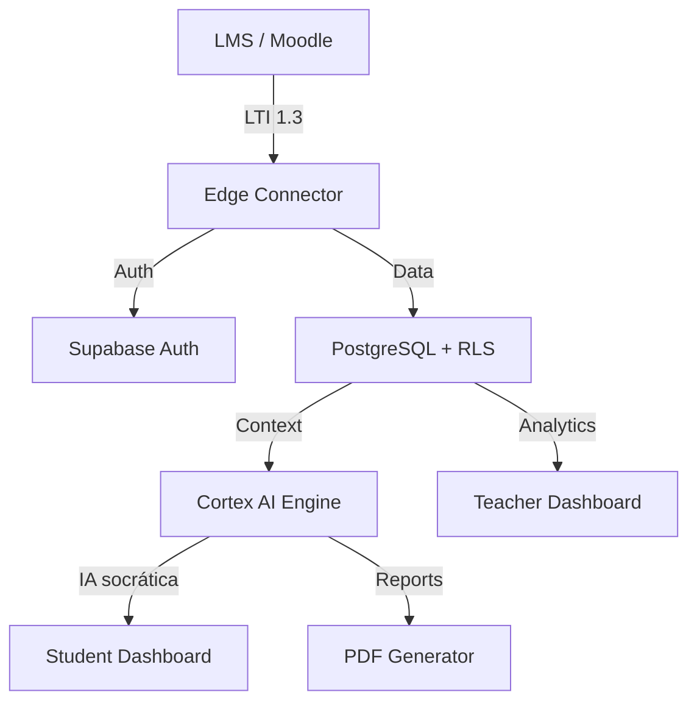

# 🏗️ Arquitectura del Sistema - My-Eutic

My-Eutic utiliza una arquitectura moderna "Serverless First" diseñada para ofrecer máxima escalabilidad y seguridad en entornos educativos.

## 🧱 Stack Tecnológico

- **Frontend**: React 18 con TypeScript y Tailwind CSS. Componentes basados en Shadcn/ui para una experiencia de usuario premium y accesible.
- **Core Backend**: Supabase (PostgreSQL) con políticas de **Row Level Security (RLS)** granulares.
- **Edge Computing**: Lógica de negocio distribuida en **Supabase Edge Functions** (Deno), minimizando la latencia global.
- **IA Engine**: Orquestación de modelos **Google Gemini 2.x Flash/Pro** con capas de pre-procesamiento pedagógico y principio **Privacy-by-Design** (los prompts de IA nunca contienen PII).
- **Interoperabilidad**: Soporte completo del estándar **LTI 1.3 Advantage** (IMS Global).

## 📊 Flujo de Datos

## 🔐 Seguridad y Escalabilidad

1. **Aislamiento Multitenant**: Cada centro educativo o institución tiene sus datos aislados mediante RLS, asegurando que un usuario solo pueda acceder a lo estrictamente necesario.
2. **Vault de Credenciales**: Las claves LTI y secretos de integración se almacenan de forma segura en el Vault de Supabase, fuera del alcance de las funciones de aplicación.
3. **Escalado Horizontal**: Al estar basado en Edge Functions, el sistema escala automáticamente para soportar miles de estudiantes simultáneos sin degradación de performance.
