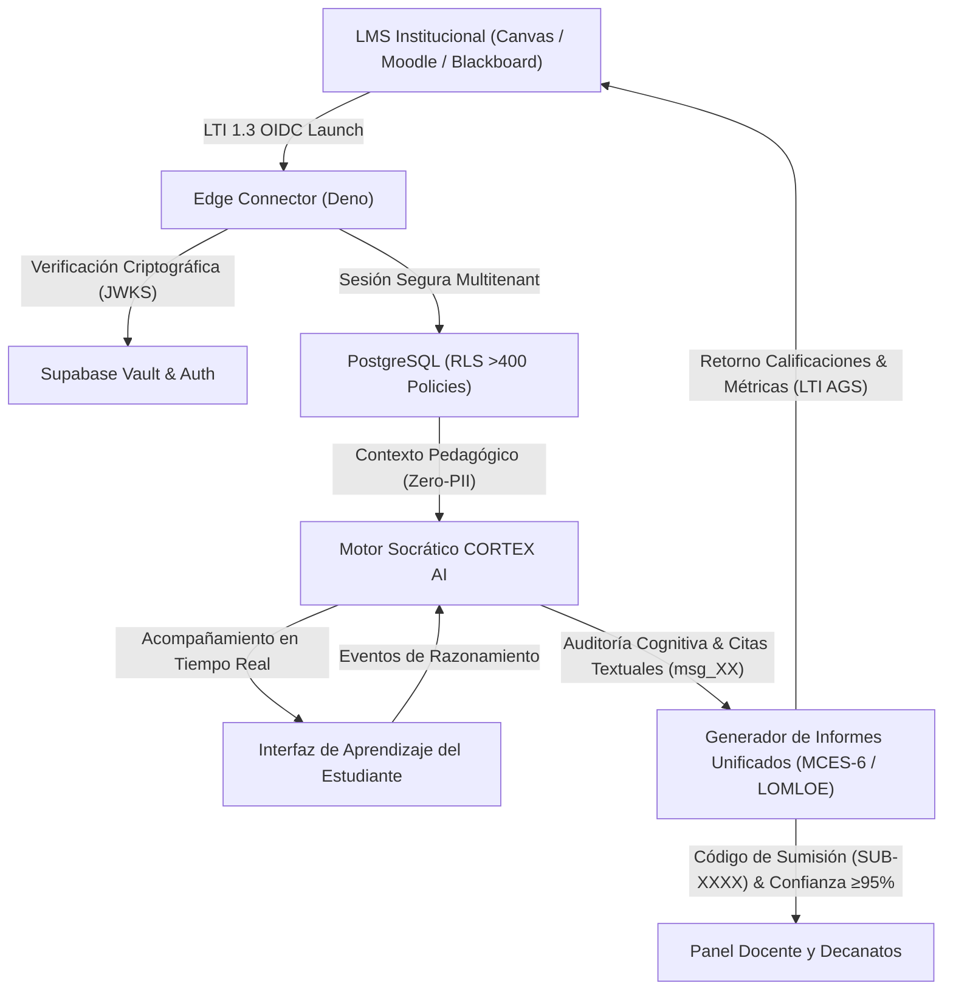

# 🏗️ Arquitectura del Sistema - My-Eutic

My-Eutic implementa una arquitectura moderna **Serverless-First y Event-Driven**, diseñada para ofrecer máxima escalabilidad, privacidad de grado corporativo e interoperabilidad estándar en entornos de educación superior y secundaria.

---

## 🧱 Stack Tecnológico

* **Frontend**: React 18 con TypeScript y Tailwind CSS. Componentes accesibles optimizados para interfaces pedagógicas interactivas sin dependencias de plugins externos.
* **Core Backend & Data Layer**: PostgreSQL gestionado con Supabase, orquestado con más de **400 políticas granulares de Row Level Security (RLS)** para aislamiento estricto multitenant.
* **Edge Computing**: Lógica de negocio distribuida en **Edge Functions (Deno)** de baja latencia global, encargadas de la autenticación LTI 1.3, intermediación socrática y streaming de eventos.
* **CORTEX Pedagogical AI Engine (Agnóstico de Modelo)**: Capa de orquestación socrática multi-fase (*Exploración*, *Provocación*, *Andamiaje*, *Consolidación*) con control de alucinaciones y guardrails metodológicos. Diseñado bajo el principio **Privacy-by-Design**: los modelos de lenguaje jamás reciben datos personales identificables (Zero-PII).
* **Universal Curriculum Engine & Socratic Forge**: Pipeline algorítmico capaz de transformar guías docentes universitarias, planes de estudio oficiales y marcos formativos en grafos de tareas socráticas estructuradas con contra-indicadores pedagógicos en 3 idiomas.
* **Interoperabilidad Estándar**: Implementación nativa y certificable de **LTI 1.3 Advantage** (Core Launch, Names and Role Provisioning Services, Assignment and Grade Services, Deep Linking).

---

## 📊 Flujo de Datos y Evaluación Invisible

```mermaid
graph TD
    A["LMS Institucional (Canvas / Moodle / Blackboard)"] -- LTI 1.3 OIDC Launch --> B["Edge Connector (Deno)"]
    B -- Verificación Criptográfica (JWKS) --> C["Supabase Vault & Auth"]
    B -- Sesión Segura Multitenant --> D["PostgreSQL (RLS >400 Policies)"]
    D -- Contexto Pedagógico (Zero-PII) --> E["Motor Socrático CORTEX AI"]
    E -- Acompañamiento en Tiempo Real --> F["Interfaz de Aprendizaje del Estudiante"]
    F -- Eventos de Razonamiento --> E
    E -- Auditoría Cognitiva & Citas Textuales (msg_XX) --> G["Generador de Informes Unificados (MCES-6 / LOMLOE)"]
    G -- Retorno Calificaciones & Métricas (LTI AGS) --> A
    G -- Código de Sumisión (SUB-XXXX) & Confianza ≥95% --> H["Panel Docente y Decanatos"]
```

---

## 🔐 Principios de Seguridad y Trazabilidad Forense

1. **Aislamiento Multitenant Absoluto**: Cada institución o centro educativo opera en un espacio lógico aislado mediante políticas RLS enforced a nivel de motor de base de datos.
2. **Criptografía y Gestión de Secretos**: Las claves privadas LTI, pares RSA/JWKS y credenciales de conectividad residen exclusivamente en almacenes de claves blindados (Vault).
3. **Escalabilidad Elástica**: Arquitectura sin servidor capaz de absorber picos masivos de sesiones simultáneas de aula o campus sin cuello de botella ni degradación de latencia.
4. **Trazabilidad Forense Inmutable**: Cada interacción socrática queda indexada de forma auditable mediante códigos de verificación de sumisión únicos (`SUB-XXXX`), mapeo competencial MCES-6 y citas directas verificadas con un 95% de confianza documental.
