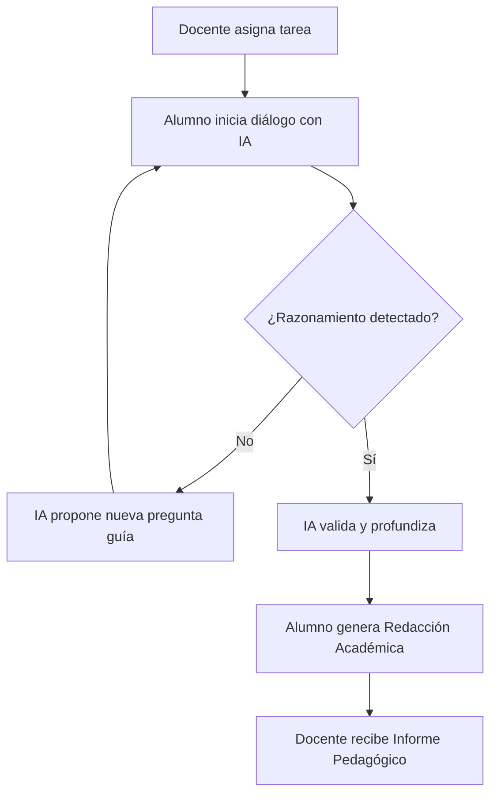

# 📖 Guía del Profesor - My-Eutic

Esta guía está diseñada para ayudar al docente a maximizar el impacto pedagógico de la IA Socrática en el aula.

## 🎯 El Método Socrático Digital

My-Eutic no es una herramienta para resolver dudas, es una herramienta para **generar pensamiento**. La IA actúa como un tutor que:
1. Nunca proporciona la solución directa.
2. Identifica lagunas en el razonamiento del alumno.
3. Propone analogías y preguntas guía para superar bloqueos.

### El Ciclo de Aprendizaje

---

## ♿ Adaptación Automática (NEE) - DUA 🚧 *(Proyecto en desarrollo)*

> [!WARNING]
> **Estado del Módulo**: Esta funcionalidad se encuentra actualmente en fase de desarrollo y pruebas técnicas (*pipeline*). Las estrategias descritas a continuación representan el motor pedagógico que se está integrando progresivamente en la plataforma.

My-Eutic integra el **Diseño Universal para el Aprendizaje (DUA)** directamente en su motor de IA. El sistema no solo adapta el contenido, sino que ajusta la *dinámica conversacional* para eliminar barreras de aprendizaje según el perfil del alumno (alineado con la normativa LOMLOE):

### Perfiles de Adaptación Específicos:

*   **TDAH (ADHD)**:
    *   **Estrategia**: Fragmentación extrema del problema y refuerzo motivacional.
    *   **Funcionamiento**: La IA aplica un **refuerzo positivo (Ratio 3:1)** constante para mantener el foco y evitar la frustración. Las instrucciones se entregan paso a paso.
*   **Dislexia / Disortografía**:
    *   **Estrategia**: Simplificación gramatical y reducción de carga cognitiva.
    *   **Funcionamiento**: El sistema utiliza frases breves, fuentes claras y evita bloques de texto densos que puedan saturar la decodificación del alumno.
*   **TEA (Trastorno del Espectro Autista)**:
    *   **Estrategia**: Lenguaje literal, estructurado y predictible.
    *   **Funcionamiento**: Se eliminan ambigüedades, metáforas confusas o dobles sentidos, asegurando una comunicación directa y altamente organizada.
*   **Altas Capacidades (Gifted)**:
    *   **Estrategia**: Elevación del nivel de abstracción y curiosidad guiada.
    *   **Funcionamiento**: Al detectar un razonamiento avanzado, el tutor socrático propone desafíos laterales y conexiones conceptuales complejas para mantener el reto intelectual.
*   **Discalculia**:
    *   **Estrategia**: Desglose procedimental detallado.
    *   **Funcionamiento**: Guía al alumno paso a paso en la lógica matemática sin saltos implícitos.

> 📝 **Nota para el docente**: Estas adaptaciones están en fase de despliegue progresivo (pipeline). El objetivo es que la IA detecte automáticamente el patrón de aprendizaje del alumno y ajuste su "personalidad" pedagógica sin intervención manual del profesor.

---

## 📈 La Evaluación Basada en Evidencias

Olvídate de corregir solo el resultado final. Con My-Eutic evalúas el **proceso**:

- **Informes Unificados**: Recibirás un documento PDF con un análisis de los indicadores alcanzados.
- **Insight Markers**: El sistema marca los momentos exactos de la conversación donde el alumno ha demostrado un avance significativo en su pensamiento crítico.

---

## 🏫 Portal de Institución

Si tu centro dispone de licencias corporativas, podrás acceder a:
- **Gestión de Clases**: Agrupa a tus alumnos y realiza seguimiento por grupos.
- **Repositorio de Tareas**: Crea tareas personalizadas o utiliza nuestro banco de recursos.
- **Analíticas de Centro**: Visualiza el impacto del pensamiento crítico a nivel global.

---

  
¿Tienes dudas pedagógicas? Contacta con nuestro equipo en <a href="mailto:pedagogia@my-eutic.org">pedagogia@my-eutic.org</a>

