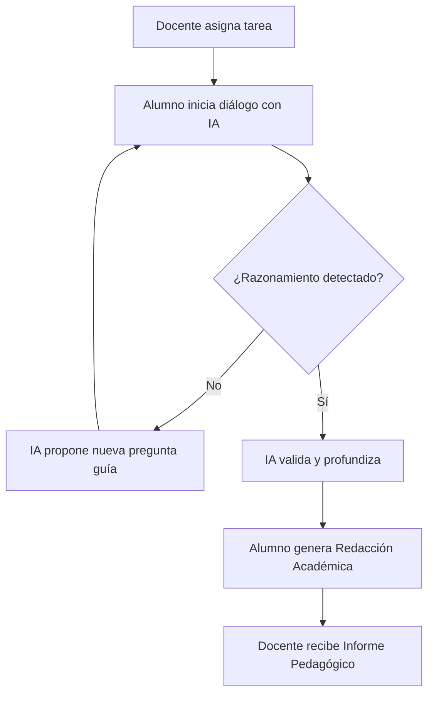

# 📖 Guía del Profesor - My-Eutic

Esta guía está diseñada para ayudar al docente a maximizar el impacto pedagógico de la IA Socrática en el aula.

## 🎯 El Método Socrático Digital

My-Eutic no es una herramienta para resolver dudas, es una herramienta para **generar pensamiento**. La IA actúa como un tutor que:
1. Nunca proporciona la solución directa.
2. Identifica lagunas en el razonamiento del alumno.
3. Propone analogías y preguntas guía para superar bloqueos.

### El Ciclo de Aprendizaje

---

## ♿ Adaptación Automática (NEE)

Una de las joyas de My-Eutic es su capacidad para adaptar el diálogo automáticamente según el perfil del alumno (según normativa LOMLOE):

- **Si el alumno tiene TDAH**: La IA utiliza instrucciones más breves, refuerza positivamente cada avance y fragmenta el problema en partes pequeñas.
- **En casos de Dislexia**: El sistema evita bloques de texto densos y prioriza estructuras gramaticales claras.
- **Para Altas Capacidades**: El tutor socrático eleva el nivel de abstracción y fomenta la exploración de conceptos relacionados.

---

## 📈 La Evaluación Basada en Evidencias

Olvídate de corregir solo el resultado final. Con My-Eutic evalúas el **proceso**:

- **Informes Unificados**: Recibirás un documento PDF con un análisis de los indicadores alcanzados.
- **Insight Markers**: El sistema marca los momentos exactos de la conversación donde el alumno ha demostrado un avance significativo en su pensamiento crítico.

---

## 🏫 Portal de Institución

Si tu centro dispone de licencias corporativas, podrás acceder a:
- **Gestión de Clases**: Agrupa a tus alumnos y realiza seguimiento por grupos.
- **Repositorio de Tareas**: Crea tareas personalizadas o utiliza nuestro banco de recursos.
- **Analíticas de Centro**: Visualiza el impacto del pensamiento crítico a nivel global.

---

  
¿Tienes dudas pedagógicas? Contacta con nuestro equipo en <a href="mailto:pedagogia@my-eutic.org">pedagogia@my-eutic.org</a>

