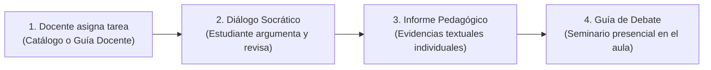

# 📖 Guía Docente: Metodología Socrática y Evaluación por Evidencias

Esta guía está dirigida al profesorado de **Educación Superior (Universidades y Escuelas de Negocio)** y de **Secundaria y Bachillerato** que busca restaurar el proceso de aprendizaje genuino frente al atajo del copiar/pegar de la IA generativa.

---

## 🎯 El Principio Socrático Digital

My-Eutic no es un asistente de respuestas: es un **entrenador del pensamiento crítico**. Su función pedagógica consiste en acompañar al estudiante para que construya, defienda y revise su propio criterio.

### ¿Cómo interviene el tutor virtual?
1. **Nunca entrega la solución directa**: Descompone el problema y devuelve la responsabilidad del razonamiento al estudiante.
2. **Reencuadre cognitivo**: Si el estudiante ofrece una respuesta superficial o de manual, la IA amplía el escenario o introduce una variable crítica.
3. **Andamiaje (Scaffolding)**: Proporciona pistas estructurales y analogías progresivas basadas exclusivamente en la base de conocimiento docente.
4. **Anclaje a la realidad**: Fuerza al estudiante a conectar los conceptos teóricos con evidencias empíricas, casos de negocio reales o experiencias cotidianas.

---

## 🔄 El Circuito Pedagógico Completo

My-Eutic no sustituye la labor docente, sino que le devuelve la visibilidad que la IA tradicional había invisibilizado:

```mermaid
graph LR
    A["1. Docente asigna tarea<br/>(Catálogo o Guía Docente)"] --> B["2. Diálogo Socrático<br/>(Estudiante argumenta y revisa)"]
    B --> C["3. Informe Pedagógico<br/>(Evidencias textuales individuales)"]
    C --> D["4. Guía de Debate<br/>(Seminario presencial en el aula)"]
```

### 1. Asignación Ágil
El docente puede elegir entre más de **9.500 tareas socráticas precargadas** (organizadas por grados universitarios, materias y niveles) o estructurar una tarea personalizada a partir de su propia guía docente en minutos.

### 2. Diálogo y Razonamiento Autónomo
El estudiante interactúa en un entorno protegido contra copiar y pegar. El tutor virtual detecta evasivas o respuestas automatizadas y exige justificación fundada antes de dar por alcanzado un hito.

### 3. Informe Pedagógico Individual
En lugar de una nota numérica arbitraria, el profesor recibe:
* **Citas textuales verificables**: Fragmentos exactos de la conversación que demuestran comprensión o señalan sesgos lógicos.
* **Mapeo competencial**: Nivel de logro alcanzado en las competencias transversales del grado o materia.
* **Puntos de refuerzo sugeridos**: Diagnóstico claro para retroalimentar al alumno con precisión quirúrgica.

### 4. Retorno al Aula Presencial (Guía de Debate)
My-Eutic sintetiza los sesgos compartidos, argumentos recurrentes y vacíos conceptuales detectados en todo el grupo, entregando al profesor una **Guía de Debate** con preguntas preparadas para liderar la discusión en clase o seminario.

---

## 🎓 Casos de Aplicación por Ámbito

### En la Universidad y Escuelas de Negocio
* **Análisis de Casos Reales (Marketing, ADE, Finanzas)**: Los estudiantes defienden decisiones estratégicas, sopesan compensaciones (*trade-offs*) y argumentan sus recomendaciones frente a las repreguntas de la IA.
* **Ética Aplicada y Gobernanza Tecnológica**: Dilemas sobre regulación, sostenibilidad y adopción de IA donde no existe una única respuesta correcta y prima el juicio crítico fundamentado.
* **Seminarios Socráticos y Preparación de Debates**: Tareas previas al aula que garantizan que los alumnos acuden a clase habiendo reflexionado a fondo sobre las lecturas.

### En Secundaria y Bachillerato
* **Situaciones de Aprendizaje Curriculares**: Retos interdisciplinares alineados con los descriptores de salida oficiales en ciencias, humanidades, matemáticas y lenguas.
* **Metacognición y Hábito Reflexivo**: Práctica distribuida (2 sesiones breves semanales) para consolidar el hábito de pensar antes de escribir.

---

## ♿ Accesibilidad y Diseño Universal para el Aprendizaje (DUA)

My-Eutic adapta la dinámica conversacional del tutor para eliminar barreras cognitivas y promover la inclusión:
* **TDAH**: Fragmentación de instrucciones, objetivos a corto plazo y refuerzo positivo sistemático.
* **Dislexia y Dificultades de Lectura**: Estructura de frases directa, vocabulario claro y reducción de saturación visual.
* **TEA**: Enunciados precisos, libres de ambigüedad, lenguaje figurado confuso o ironías.
* **Altas Capacidades**: Profundización conceptual automática, derivación hacia pensamiento lateral y aumento del reto intelectual.
* **Discalculia**: Acompañamiento procedimental explícito en problemas numéricos y lógicos.

---

## 📊 Integración en tu LMS

My-Eutic funciona de manera transparente dentro de **Moodle, Canvas LMS o Blackboard**:
* Los estudiantes acceden con un solo clic desde el campus virtual institucional (Single Sign-On).
* No requiere altas manuales de cuentas ni intercambio de contraseñas.
* Calificaciones y evidencias se sincronizan con el libro de calificaciones del curso institucional mediante **LTI 1.3 Advantage**.

---

  
Para consultas pedagógicas o diseño de experiencias a medida: <a href="mailto:pedagogia@my-eutic.org">pedagogia@my-eutic.org</a>

