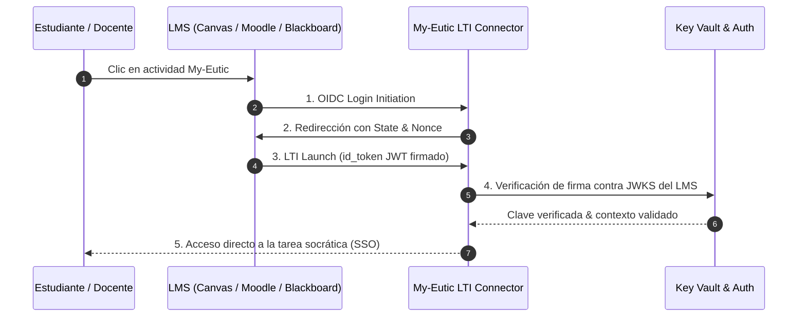

# 🔌 Guía de Integración LTI 1.3 Advantage - My-Eutic

Esta especificación técnica detalla cómo conectar My-Eutic con cualquier Learning Management System (LMS) compatible con el estándar **LTI 1.3 Advantage** (IMS Global / 1EdTech).

---

## ⚡ Registro Dinámico (Recomendado para Moodle 3.10+)

My-Eutic soporta **LTI Dynamic Registration**, permitiendo que el LMS configure automáticamente claves criptográficas, endpoints y capacidades en segundos:

1. Accede a **Administración del sitio** > **Extensiones** > **Herramientas externas** > **Gestionar herramientas**.
2. Introduce la URL de autoconfiguración en el campo "URL de la herramienta":
   ```text
   https://mvp.my-eutic.org/functions/v1/moodle-lti-connector/lti/config
   ```
3. Haz clic en **Añadir LTI Advantage**. El LMS intercambiará los metadatos y completará el registro de forma desatendida.

---

## 🛠️ Configuración Manual (Canvas LMS, Blackboard Learn, Brightspace D2L)

Para plataformas con aprovisionamiento manual o entornos universitarios con restricciones de cortafuegos:

| Parámetro Técnico | Valor Canónico |
|---|---|
| **OIDC Login Initiation URL** | `https://mvp.my-eutic.org/functions/v1/moodle-lti-connector/lti/login` |
| **Tool Redirect / Target Link URI** | `https://mvp.my-eutic.org/functions/v1/moodle-lti-connector/lti/launch` |
| **Public Keyset URL (JWKS)** | `https://mvp.my-eutic.org/functions/v1/moodle-lti-connector/jwks` |
| **Deep Linking Support** | Habilitado (`LtiDeepLinkingRequest`) |
| **Grade Synchronization** | Habilitado (LTI Assignment and Grade Services - AGS) |
| **Roster / Cohort Sync** | Habilitado (Names and Role Provisioning Services - NRPS) |

---

## 🔄 Flujo Criptográfico y Aislamiento de Sesión



---

## 💎 Capacidades Certificadas LTI 1.3 Advantage

1. **Aprovisionamiento Automático (Zero Setup)**: Ni el docente ni el estudiante necesitan crear credenciales o recordar contraseñas. El perfil se valida de forma transparente en el primer acceso.
2. **Deep Linking Intuitivo**: El profesorado puede navegar por el catálogo socrático o sus tareas personalizadas y vincular la actividad exacta al tema del curso directamente desde la interfaz del LMS.
3. **Retorno Automatizado de Evaluaciones (Grade Passback)**: Al completar la sesión socrática y generarse el informe con evidencias, My-Eutic devuelve la calificación e indicadores de logro al libro de calificaciones oficial.
4. **Privacidad Garantizada (Zero-PII en IA)**: El identificador LTI del estudiante es seudonimizado en origen, garantizando que los nombres reales no viajan a modelos de lenguaje externos.

---

<div align="center">
  <p>Para consultas sobre despliegues institucionales o soporte técnico LTI: <a href="mailto:soporte@my-eutic.org">soporte@my-eutic.org</a></p>
</div>
