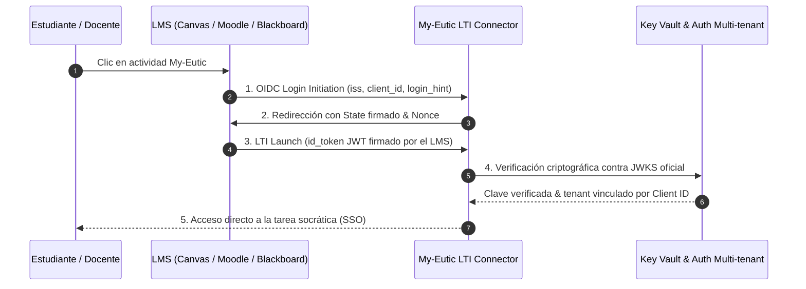

# 🔌 Guía de Integración LTI 1.3 Advantage - My-Eutic

Esta especificación técnica detalla cómo conectar My-Eutic con cualquier Learning Management System (LMS) compatible con el estándar **LTI 1.3 Advantage** (IMS Global / 1EdTech).

---

## ⚡ Métodos de Integración por Plataforma

My-Eutic ofrece flujos optimizados y certificados para las tres principales plataformas del ecosistema educativo:

| Plataforma LMS | Método de Conexión | Tiempo | Guía Específica |
|---|---|---|---|
| **Moodle (3.10+)** | **Dynamic Registration** (Plug & Play instantáneo) | < 1 min | 📖 **[Guía para Moodle](setup-moodle.md)** |
| **Canvas LMS (Instructure)** | **Developer Key vía JSON URL** | ~3 min | 🎨 **[Guía para Canvas](setup-canvas.md)** |
| **Blackboard Learn (Anthology)** | **Anthology Central Application ID** | ~2 min | 🖤 **[Guía para Blackboard](setup-blackboard.md)** |
| **Brightspace (D2L) / Sakai / Otros** | **Configuración Estándar OIDC/LTI 1.3** | ~5 min | Ver tabla de parámetros abajo |

---

## 1. Moodle: Registro Dinámico (Dynamic Registration)

My-Eutic soporta **LTI Dynamic Registration** conforme al estándar 1EdTech, permitiendo que Moodle autoconfigure claves criptográficas, endpoints y capacidades de forma desatendida:

1. Accede a **Administración del sitio** > **Extensiones** > **Herramientas externas** > **Gestionar herramientas**.
2. Introduce la URL de autoconfiguración en el campo "URL de la herramienta":
   ```text
   https://hsevkyjsyqzzpmnvrhan.supabase.co/functions/v1/moodle-lti-connector/lti/config
   ```
3. Haz clic en **Añadir LTI Advantage**. Moodle intercambiará los metadatos y completará el registro en segundos.
4. Consulta el paso a paso completo con capturas en **[setup-moodle.md](setup-moodle.md)**.

---

## 2. Canvas LMS: Developer Key vía URL

Canvas permite el registro desatendido mediante su intérprete de JSON URL:

1. Ve a **Admin** > **Developer Keys** > **+ Developer Key** > **+ LTI Key**.
2. En **Method**, selecciona **Enter URL**.
3. Pega la URL de configuración:
   ```text
   https://hsevkyjsyqzzpmnvrhan.supabase.co/functions/v1/moodle-lti-connector/lti/config
   ```
4. Guarda, activa la clave en **ON** y facilita el **Client ID** a My-Eutic para vincular tu institución.
5. Consulta la guía completa en **[setup-canvas.md](setup-canvas.md)**.

---

## 3. Blackboard Learn Ultra: Registro Central Anthology

My-Eutic está registrado centralmente en la red oficial de **Anthology Developer Network**, eliminando la necesidad de introducir URLs a mano:

1. En el **Panel del Administrador** de Blackboard, entra en **Proveedores de herramientas LTI** > **Registrar herramienta LTI 1.3**.
2. Introduce el **Application ID oficial de My-Eutic**:
   ```text
   60cd6f5c-8f2d-40aa-9ab8-1e6be94223f4
   ```
3. Blackboard cargará automáticamente todas las claves y endpoints. Aprueba la herramienta y responde a My-Eutic con el **Deployment ID** generado.
4. Consulta la guía completa en **[setup-blackboard.md](setup-blackboard.md)**.

---

## 🛠️ Parámetros Técnicos Canónicos (Para D2L, Sakai u otros LMS)

Para plataformas con aprovisionamiento manual o entornos universitarios con cortafuegos perimetrales:

| Parámetro Técnico | Endpoint Oficial Canónico |
|---|---|
| **OIDC Login Initiation URL** | `https://hsevkyjsyqzzpmnvrhan.supabase.co/functions/v1/moodle-lti-connector/oidc/login` |
| **Tool Redirect / Target Link URI** | `https://hsevkyjsyqzzpmnvrhan.supabase.co/functions/v1/moodle-lti-connector/launch` |
| **Public Keyset URL (JWKS)** | `https://hsevkyjsyqzzpmnvrhan.supabase.co/functions/v1/moodle-lti-connector/.well-known/jwks.json` |
| **Deep Linking Support** | Habilitado (`LtiDeepLinkingRequest`) en `/lti/deep-linking` |
| **Grade Synchronization (AGS)** | Habilitado (Assignment and Grade Services) en `/lti/ags/scores` |
| **Roster Sync (NRPS)** | Habilitado (Names and Role Provisioning Services) en `/lti/nrps/sync` |

---

## 🔄 Flujo Criptográfico y Aislamiento de Sesión



---

## 💎 Capacidades Certificadas LTI 1.3 Advantage

1. **Aprovisionamiento Automático (Zero Setup)**: Ni el docente ni el estudiante necesitan crear credenciales o recordar contraseñas. El perfil se valida de forma transparente en el primer acceso.
2. **Deep Linking Intuitivo**: El profesorado puede navegar por el catálogo socrático o sus tareas personalizadas y vincular la actividad exacta al tema del curso directamente desde la interfaz del LMS.
3. **Retorno Automatizado de Evaluaciones (Grade Passback)**: Al completar la sesión socrática y generarse el informe con evidencias, My-Eutic devuelve la calificación e indicadores de logro al libro de calificaciones oficial.
4. **Privacidad Garantizada (Zero-PII en IA)**: El identificador LTI del estudiante es seudonimizado en origen, garantizando que los nombres reales no viajan a modelos de lenguaje externos.

---

<div align="center">
  <p>Para consultas sobre despliegues institucionales o soporte técnico LTI: <a href="mailto:soporte@my-eutic.org">soporte@my-eutic.org</a></p>
</div>
