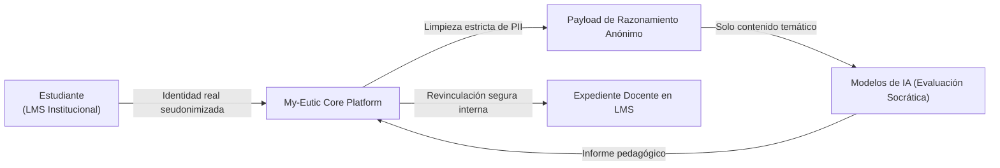

# 🔒 Seguridad, Privacidad y Soberanía de Datos (Data Sovereignty)

En My-Eutic, la privacidad de los datos educativos y la soberanía institucional son principios fundacionales. Diseñamos la plataforma para superar las auditorías técnicas y legales más rigurosas de universidades, administraciones públicas y centros educativos (RGPD/GDPR, ENS, FERPA).

---

## 🛡️ Cumplimiento RGPD (GDPR) y Privacidad por Diseño

* **Minimización Estricta de Datos**: Solo se procesan los datos estrictamente indispensables para la interacción pedagógica.
* **Derechos ARCO Automatizados**: Procedimientos integrados para el ejercicio efectivo de los derechos de acceso, rectificación, supresión y limitación del tratamiento.
* **Auditoría y Consentimiento Trazable**: Registro de metadatos de acceso, firmas de acuerdos de confidencialidad y control de versiones de términos de servicio.

---

## 🔐 Blindaje Técnico Multicapa

### Row Level Security (RLS) en Base de Datos
Nuestra arquitectura PostgreSQL aplica seguridad a nivel de fila estricta. Ningún usuario o institución puede leer o modificar registros pertenecientes a otro tenant, incluso ante eventuales vulnerabilidades en capas superiores de la aplicación.
* Contamos con más de **400 políticas RLS activas** permanentemente auditadas.

### Cifrado de Grado Bancario
* **En Tránsito**: Todas las comunicaciones externas e internas se canalizan obligatoriamente bajo **TLS 1.3** con suites criptográficas modernas.
* **En Reposo**: La base de datos y los almacenes de evidencias aplican cifrado **AES-256**.
* **Gestión Segura de Claves (Vault)**: Las claves privadas RSA/JWKS utilizadas en el intercambio LTI 1.3 residen en módulos de almacén seguro (Vault), inaccesibles para el código de cliente y excluidas de cualquier log de sistema.

---

## 🤖 Compromiso Cero-PII en el Motor de Inteligencia Artificial

Este es el pilar de confianza fundamental para las instituciones que integran My-Eutic en sus campus virtuales:

### Principios Operativos del Desacoplamiento de Identidad:
1. **Los modelos de lenguaje jamás reciben datos personales identificables (Zero-PII)**: Nombres, apellidos, correos electrónicos o identificadores de matrícula son eliminados en la pasarela antes de consultar cualquier API de inferencia.
2. **Contextualización Inclusiva Segura**: Cuando un alumno cuenta con adaptaciones pedagógicas (DUA / NEE), solo se transmite una etiqueta pedagógica abstracta de acompañamiento, sin referencia a su identidad personal.
3. **No Entrenamiento con Datos Educativos**: Los acuerdos y configuraciones de inferencia garantizan que las interacciones no son utilizadas para reentrenar modelos fundacionales públicos ni comerciales.

---

## 🏫 Gobernanza y Control Institucional

Los responsables académicos y delegados de protección de datos (DPO) de la institución mantienen el control absoluto sobre la información:
* **Segmentación por Facultades, Departamentos o Cursos**: Permisos delegados según roles académicos oficiales.
* **Políticas de Retención y Borrado Seguro**: Supresión programada e irrevocable de registros al término del ciclo académico o proyecto piloto.
* **Trazabilidad Forense**: Registro auditable de eventos de acceso y evaluación con sellado temporal.

---

  
Para contactar con el Delegado de Protección de Datos (DPO): <a href="mailto:privacidad@my-eutic.org">privacidad@my-eutic.org</a>

